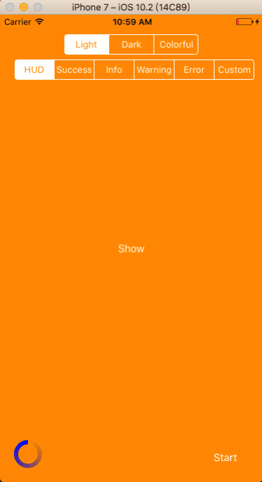

# DTMessageHUD

[](https://swift.org/)
[](http://cocoadocs.org/docsets/DTMessageHUD)
[](https://cocoapods.org/pods/DTMessageHUD)
[](https://github.com/Carthage/Carthage)

## Introduction

Simple loading HUD and image message.



## Installation

### Requirement

iOS 8.4+

### [CocoaPods](http://cocoapods.org)

To install DTMessageHUD add a dependency to your Podfile:

```
pod "DTMessageHUD"
```

### [Carthage](https://github.com/Carthage/Carthage)

To install DTMessageHUD add a dependency to your Cartfile:

```
github "danjiang/DTMessageHUD"
```

```
carthage update --platform ios
```

## Usage

### Import

```swift
import DTMessageHUD
```

### Use in Window

```swift
// Show loading HUD. Dismiss by yourself
DTMessageHUD.hud()
DTMessageHUD.dismiss()

// Show image message. Dismiss automatically
DTMessageHUD.success()
DTMessageHUD.info()
DTMessageHUD.warning()
DTMessageHUD.error()
DTMessageHUD.custom(image: #imageLiteral(resourceName: "dollar"))
```

### Use in View

```swift
// Want to put mesage view in this view
@IBOutlet weak var boxView: UIView!

// Show loading HUD. Dismiss by yourself
DTMessageHUD.hud(inView: boxView)
DTMessageHUD.dismiss(inView: boxView)

// Show image message. Dismiss automatically
DTMessageHUD.success(inView: boxView)
DTMessageHUD.info(inView: boxView)
DTMessageHUD.warning(inView: boxView)
DTMessageHUD.error(inView: boxView)
DTMessageHUD.custom(image: #imageLiteral(resourceName: "dollar"), inView: boxView)
```

### Customize

```swift
DTMessageHUD.theme = DTMessageHUD.LightTheme() // Default theme
DTMessageHUD.theme = DTMessageHUD.DarkTheme()
DTMessageHUD.theme = DTMessageHUD.ColorfulTheme()

// Impelement DTMessageHUDTheme to provide your own theme

struct MyTheme: DTMessageHUDTheme {
	...
}

DTMessageHUD.theme = MyTheme()
```

### Circular Loading View

```swift
// Use circular loading view directly. Start animation and stop animation by yourself
let loadingView = DTCircularLoadingView(frame: CGRect(x: 0, y: 0, width: 40, height: 40),
                                          insetX: 3,
                                          insetY: 3,
                                          lineWidth: 6,
                                          strokeColor: UIColor.blue)
loadingView.startAnimation()
loadingView.stopAnimation()
```

## TODO

* circular progress view
* linear progress view 